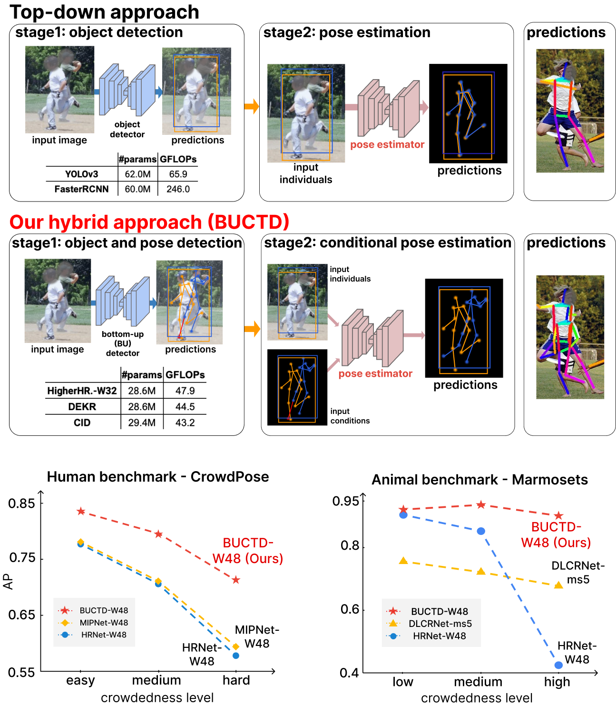

# Bottom-up conditioned top-down pose estimation (BUCTD) 
This repository will contain the official code for our pre-print: [Rethinking pose estimation in crowds: overcoming the detection information-bottleneck and ambiguity](https://arxiv.org/abs/2306.07879). This work was also presented at the 2023 [CV4Animals workshop at CVPR](https://www.cv4animals.com)!



Code will be made available soon!

This code will also be integrated in [DeepLabCut](https://github.com/DeepLabCut/DeepLabCut)!

### Code Acknowledgements
We are grateful to the authors of [HRNet](https://github.com/HRNet/deep-high-resolution-net.pytorch) and [MIPNet](https://rawalkhirodkar.github.io/mipnet) as our code builds on their work! 


## Reference

If you find this code useful, please cite:

[Rethinking pose estimation in crowds: overcoming the detection information-bottleneck and ambiguity](https://arxiv.org/abs/2306.07879) by Mu Zhou*, Lucas Stoffl*, Mackenzie Mathis and Alexander Mathis.

```
@misc{zhou2023rethinking,
      title={Rethinking pose estimation in crowds: overcoming the detection information-bottleneck and ambiguity}, 
      author={Mu Zhou and Lucas Stoffl and Mackenzie Mathis and Alexander Mathis},
      year={2023},
      eprint={2306.07879},
      archivePrefix={arXiv},
      primaryClass={cs.CV}
}
```

# License

BUCTD will be released under the Apache 2.0 license. Please see the [LICENSE](LICENSE) file for more information.
